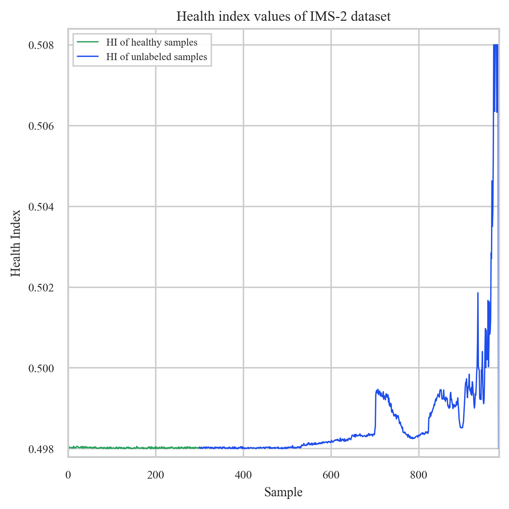

<div align="center">

# BEARING-FDD: Reproduction & Extension

**Early detection and explainable diagnosis of bearing faults from raw vibration signals: a critical reproduction of the MS2AE-based BEARING-FDD tool on the IMS and XJTU-SY run-to-failure datasets.**

[](https://www.python.org/)
[](https://www.tensorflow.org/)
[](https://flask.palletsprojects.com/)
[](https://spring.io/projects/spring-boot)
[](LICENSE.txt)

</div>

> **About this fork.** The original tool is
> [s2css-uniovi/bearing-fdd](https://github.com/s2css-uniovi/bearing-fdd) by the S2CSS group
> (University of Oviedo), described in Magadán *et al.*, *Advanced Engineering Informatics* (2024) and
> *Software Impacts* (2026). This fork, by **Vu Tri Long**, reproduces the method end-to-end on seven
> run-to-failure datasets and reports where the reproduction agrees and disagrees with the paper.
>
> **Status:** this repository currently publishes the **reproduction results and analysis**. The source
> code in `src/` is still the original upstream version. My implementation work is under active
> development and will be released once it is stable. It covers the windowed MS2AE, the XAI fixes, the
> experiment scripts, a reproducible Kaggle package and a Streamlit dashboard.

## Scope of the reproduction

| Area | Work |
|---|---|
| **Signal processing / XAI review** | Found and corrected three issues in the envelope-spectrum and XAI code: a missing Hilbert envelope, a sampling rate hard-coded to 20 kHz, and fault-frequency amplitudes looked up by FFT bin index instead of by frequency in Hz. |
| **Health-indicator model** | Windowed MS2AE (2,048-point windows, HI = P95 of the window reconstruction MSE) and a Table-1-inspired dense autoencoder, trained per dataset. |
| **Experiments** | FFP, XAI, stage and range-voting diagnosis evaluation on **7 datasets** (IMS-1/2/3, XJTU-SY 2-1, 2-3, 3-1, 3-4), plus regularisation (λ) and latent-dimension sensitivity studies on IMS-2. |
| **Critical analysis** | [`docs/critical_analysis_vi.md`](docs/critical_analysis_vi.md) lists the differences between the paper, the original code and the rerun results. |

*The implementation behind these results is not yet published (see Status above).*

## Pipeline

```text
raw vibration (IMS: 20,480 pts @ 20.48 kHz · XJTU-SY: 32,768 pts @ 25.6 kHz)
 → autoencoder health indicator (HI)
 → threshold = P95 of healthy HI → First Faulty Point (FFP) = first of 5 consecutive exceedances
 → fault isolation against the healthy baseline (DTW alignment)
 → kurtogram → Butterworth band-pass → Hilbert envelope → FFT
 → harmonic matching of BPFO / BPFI / BSF / FTF (1X–6X) → fault type and stage
 → XAI: Pearson correlation of the HI with time- and frequency-domain engineering features
```

## Results

### First Faulty Point: rerun vs. paper

| Dataset | Rerun FFP | Paper FFP | Comment |
|---|---:|---:|---|
| IMS-1 | 1091 | 1857 | much earlier: true early fault or false alarm, not confirmed |
| **IMS-2** | **532** | **536** | closest to the paper; used as the walkthrough case |
| IMS-3 | 5940 | 5967 | close to the paper |
| XJTU-SY 2-1 | 383 | 451 | 68 samples earlier |
| **XJTU-SY 2-3** | **301** | **301** | identical |
| XJTU-SY 3-1 | 1268 | 2347 | 1,079 samples earlier |
| XJTU-SY 3-4 | 468 | 1416 | 948 samples earlier |

Fault diagnosis per degradation stage (early / medium / last) is in
[`research/results/tables/table2_results_summary.md`](research/results/tables/table2_results_summary.md).
On IMS-2, the outer-race fault (BPFO, 1X–5X harmonics) is recovered at all three stages.

<p align="center">
  
  
</p>

### Key findings from the reproduction

- **The FFP is sensitive to implementation details the paper does not specify.** These include the HI definition, window size, regulariser weights and the threshold tail. In the λ-sensitivity study on IMS-2, 9 of the 10 regularised full-sample models never raised an FFP. The remaining model raised it at #971, while the paper reports #536.
- **The autoencoder HI behaves almost like signal energy.** Across latent sizes k = 1, 8, 16, 32 and 64, the FFP stays at #533. An audit shows that the HI tracks RMS² closely, so a close FFP alone is **not** evidence that the network learned degradation features.
- **The live diagnosis and the batch evaluation use different rules.** The web endpoint and the range-voting evaluation apply different peak and harmonic rules, so their results are reported separately.

These are reproduction results on public datasets. They are **not** a claim that the original MS2AE
was reproduced exactly, and the system is not validated for industrial use.

## Repository structure

```text
.
├── src/                    # original BEARING-FDD code (Flask API, Spring frontend, database), unchanged
├── research/results/
│   ├── tables/             # Table 2 style summary + FFP / XAI results for all 7 datasets
│   ├── figures/            # IMS-2 case study, Fig. 8–15 (PNG + SVG)
│   └── logs/               # windowed MS2AE training logs, range-voting diagnosis comparisons
├── docs/                   # critical analysis (Vietnamese) and pipeline diagrams
└── images/                 # original architecture figure
```

To run the original web tool, see the original README below.

## Citation

If you use this work, please cite the original papers:

```bibtex
@article{magadan2024explainable,
  title   = {Explainable and interpretable bearing fault classification and diagnosis under limited data},
  author  = {Magad{\'a}n, L. and Ruiz-C{\'a}rcel, C. and Granda, J.C. and Su{\'a}rez, F.J. and Starr, A.},
  journal = {Advanced Engineering Informatics},
  volume  = {62},
  pages   = {102909},
  year    = {2024},
  doi     = {10.1016/j.aei.2024.102909}
}

@article{magadan2026bearingfdd,
  title   = {{BEARING-FDD}: An early detection and diagnosis tool for bearing faults in rotating machinery},
  author  = {Magad{\'a}n, L. and Ruiz-C{\'a}rcel, C. and Granda, J.C. and Su{\'a}rez, F.J. and Men{\'e}ndez-Gonz{\'a}lez, A. and Starr, A.},
  journal = {Software Impacts},
  volume  = {27},
  pages   = {100810},
  year    = {2026},
  doi     = {10.1016/j.simpa.2025.100810}
}
```

## License

MIT. The original code is © 2024 S2CSS Research group (see [LICENSE.txt](LICENSE.txt)). The
results and documentation added in this fork are released under the same license.

---

<details>
<summary><b>Original README (upstream)</b></summary>

# Detection and Diagnosis of Bearing Faults on Electric Motors
This repo contains the source code of a tool for bearing fault detection and diagnosis.

The tool provides explainable and interpretable bearing fault detection, diagnosis and classification. Users can use well-known preloaded datasets or upload their own to perform bearing fault analysis. Uploaded raw vibration data is compressed into a health indicator that determines the stage of degradation of the bearing. The primary goal of the software is to detect, diagnose and classify faults in rotating machinery without any human intervention (e.g., manually extracting features), while providing users with explainable and interpretable results.

The architecture of the proposed software is shown in the following figure.


The application consists of three main components: a frontend, a REST API and a relational database.

The `src/` directory contains the source code of the three components:

 - `src/database`. This directory contains the scripts to create the database.
 - `src/backend`. This directory contains the source code of the REST API. This is implemented in Python using the Flask framework.
 - `src/frontend`. This directory contains the source code of the frontend of the web application. This is implemented in Java Spring a needs to be deployed in an application server such as Tomcat.

You can test a running deployment of the application in the following link.

https://bearing-fdd.uniovi.es

</details>
