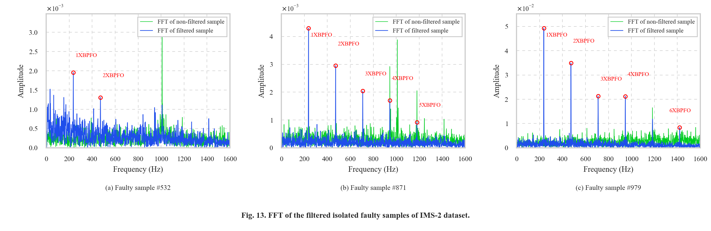

<div align="center">

# BEARING-FDD: Reproduction

**Reproduction of the MS2AE-based BEARING-FDD tool for early detection and explainable diagnosis of bearing faults on the IMS and XJTU-SY run-to-failure datasets.**

[](https://www.python.org/)
[](https://www.tensorflow.org/)
[](LICENSE.txt)

</div>

> Fork of [s2css-uniovi/bearing-fdd](https://github.com/s2css-uniovi/bearing-fdd) (Magadán *et al.*, 2024; 2026).
> This repository publishes the **reproduction results and analysis** by **Vu Tri Long**. `src/` is the
> unchanged original code; my implementation is still in development and is not included yet.

## Pipeline

```text
raw vibration (IMS: 20,480 pts @ 20.48 kHz · XJTU-SY: 32,768 pts @ 25.6 kHz)
 → autoencoder health indicator (HI)
 → threshold = P95 of healthy HI → First Faulty Point (FFP) = first of 5 consecutive exceedances
 → fault isolation against the healthy baseline (DTW alignment)
 → kurtogram → band-pass → Hilbert envelope → FFT
 → harmonic matching of BPFO / BPFI / BSF / FTF → fault type and stage
 → XAI: correlation of the HI with engineering features
```

## Results

| Dataset | Rerun FFP | Paper FFP |
|---|---:|---:|
| IMS-1 | 1091 | 1857 |
| **IMS-2** | **532** | **536** |
| IMS-3 | 5940 | 5967 |
| XJTU-SY 2-1 | 383 | 451 |
| **XJTU-SY 2-3** | **301** | **301** |
| XJTU-SY 3-1 | 1268 | 2347 |
| XJTU-SY 3-4 | 468 | 1416 |

Diagnosis per degradation stage is in [Table 2](results/table2_summary.md).
On IMS-2, the outer-race fault (BPFO harmonics) is recovered at all three stages. Two IMS-2 values
(the threshold and the top-3 features) are unverified; see the
[provenance notes](results/table2_summary.md#provenance-notes).

<p align="center">
  
  
</p>

The differences between the paper, the original code and the rerun are discussed in
[`docs/critical_analysis_vi.md`](docs/critical_analysis_vi.md) (Vietnamese). These are reproduction
results, not a claim of exact reproduction or industrial validation.

## Repository structure

```text
.
├── src/                 # original BEARING-FDD code (unchanged)
├── results/
│   ├── 01_hi_training/       # windowed MS2AE training logs per dataset
│   ├── 02_ffp_xai/           # FFP, threshold and XAI correlations; IMS-2 case study
│   ├── 03_fault_diagnosis/   # range-voting diagnosis for IMS and XJTU-SY
│   ├── 04_figures_ims2/      # IMS-2 case study, Fig. 8–15 (PNG + SVG)
│   └── table2_summary.md     # Table 2: FFP, stage, band and diagnosis per dataset
├── docs/                # critical_analysis_vi.md, diagrams/
└── images/              # original architecture figure
```

To run the original tool, see the original README below. Note that it needs MySQL, a MATLAB Engine
installation for the kurtogram, and `flask-sqlalchemy` / `mysql-connector-python`, which its
`requirements.txt` does not list.

## Citation

If you use this work, please cite the original papers:

```bibtex
@article{magadan2024explainable,
  title   = {Explainable and interpretable bearing fault classification and diagnosis under limited data},
  author  = {Magad{\'a}n, L. and Ruiz-C{\'a}rcel, C. and Granda, J.C. and Su{\'a}rez, F.J. and Starr, A.},
  journal = {Advanced Engineering Informatics},
  volume  = {62},
  pages   = {102909},
  year    = {2024},
  doi     = {10.1016/j.aei.2024.102909}
}

@article{magadan2026bearingfdd,
  title   = {{BEARING-FDD}: An early detection and diagnosis tool for bearing faults in rotating machinery},
  author  = {Magad{\'a}n, L. and Ruiz-C{\'a}rcel, C. and Granda, J.C. and Su{\'a}rez, F.J. and Men{\'e}ndez-Gonz{\'a}lez, A. and Starr, A.},
  journal = {Software Impacts},
  volume  = {27},
  pages   = {100810},
  year    = {2026},
  doi     = {10.1016/j.simpa.2025.100810}
}
```

## License

MIT. The original code is © 2024 S2CSS Research group (see [LICENSE.txt](LICENSE.txt)). The
results and documentation added in this fork are released under the same license.

---

<details>
<summary><b>Original README (upstream)</b></summary>

# Detection and Diagnosis of Bearing Faults on Electric Motors
This repo contains the source code of a tool for bearing fault detection and diagnosis.

The tool provides explainable and interpretable bearing fault detection, diagnosis and classification. Users can use well-known preloaded datasets or upload their own to perform bearing fault analysis. Uploaded raw vibration data is compressed into a health indicator that determines the stage of degradation of the bearing. The primary goal of the software is to detect, diagnose and classify faults in rotating machinery without any human intervention (e.g., manually extracting features), while providing users with explainable and interpretable results.

The architecture of the proposed software is shown in the following figure.


The application consists of three main components: a frontend, a REST API and a relational database.

The `src/` directory contains the source code of the three components:

 - `src/database`. This directory contains the scripts to create the database.
 - `src/backend`. This directory contains the source code of the REST API. This is implemented in Python using the Flask framework.
 - `src/frontend`. This directory contains the source code of the frontend of the web application. This is implemented in Java Spring a needs to be deployed in an application server such as Tomcat.

You can test a running deployment of the application in the following link.

https://bearing-fdd.uniovi.es

</details>
